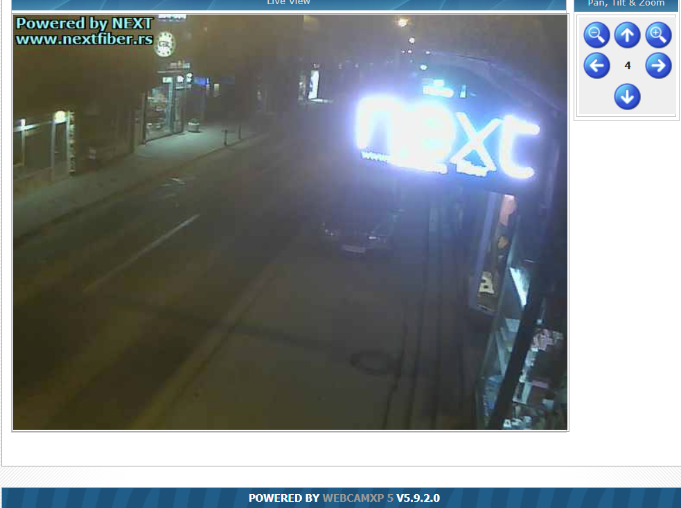

# Google-Hacking
Hacks that can be accomplished using simple Google searches

## Webcam Hacking
To hack webcams, use: ``` intitle:"webcamxp 5" ```
Where ```in title``` stands for searching for the listed string in the title of the webpage. This produced the corresponing result:
 
 
## Database Password Discovery

Database passwords can also be discovered using the command: ``` filetype:env "DB_PASSWORD"``` An example of the search produced the following results (which should not be used for malicious purposes).


## Authentication Failures

Log files that contain authentication failures can also be discovered using the following command:```"authentication failure logname=" filetype:log```


## Registry Files

Registry keys cna also be found using: ```filetype:reg reg HKEY_CURRENT_USER username```

## Nessus Scans

Nessus scans which are a vulnerability scanning tool can also be used to search for vulnerabilities within systems. For example using the command ``` intitle:"Nessus Scan Report" "This file was generated by Nessus" ```
The following results found a nessus scan report:

This report can be used by a hacker to perform a vulnerability exploit.

## Remote Desktops

Connecting to remote desktops can also be possible using the following command: ``` allinurl:tsweb/default.htm ``. This searches for any terminal services for remote desktops.

Brute forcing the password can be further accomplished with password cracking tools like hashcat, etc.

## Google Dorking Database

The google dorking database is also a common tool that can execute dorks for searches. E.g.

The Harvester is also a tool that can be used to search for emails or sub domains that are associated with a keyword.
